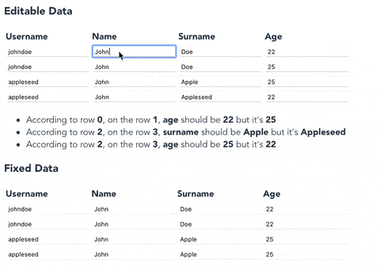

# ⛓️ honst

> The name: I wanted it to be "honest", but it was occupied, so I removed a letter, and it became "honst".

Data Integrity fixer for an **object matrix**.

## Use Cases
- On editing a **joined** matrix data needs the data integrity to be kept.
- Keeping your local state correct.

## Demo



You can play with honst on CodeSandbox:

[](https://codesandbox.io/s/honst-demo-6s187?fontsize=14&hidenavigation=1&theme=light)

## Overview

```js
const data = [
  { username: "johndoe", name: "John", surname: "Doe", age: "22" },
  { username: "johndoe", name: "John", surname: "Doe", age: "25" },
  { username: "johndoe2", name: "John", surname: "Doe", age: "22" },
  { username: "johndoe2", name: "John", surname: "Doez", age: "22" },
]
```

According to `username` field, there are many integrity issues around the array. So let **honst** fix these:

```diff
[
  { username: "johndoe", name: "John", surname: "Doe", age: 22 },
-  { username: "johndoe", name: "John", surname: "Doe", age: 25 },
+  { username: "johndoe", name: "John", surname: "Doe", age: 22 },
  { username: "johnapple", name: "John", surname: "Apple", age: 29 },
- { username: "johnapple", name: "John", surname: "Orange", age: 22 },
+ { username: "johnapple", name: "John", surname: "Apple", age: 29 },
]
```

1. Referencing to `data[0].username`, `name`, `surname`, and `age` should be `John`, `Doe` and `22`.
2. But `data[1].age` is `25` and it should be fixed.
3. Referencing to `data[3].username`, `name`, `surname`, and `age` should be `John`, `Apple` and `29`.
4. But `data[1].age` is `25`, `data[1].surname` is `Orange` and these should be fixed as well.

**honst** simply fixes these integrity issues.

## Usage

Install using `npm` or `yarn`:

```
npm install honst
# or
yarn add honst
```

Now you can start:

```js
import { honst } from 'honst';

const { data, delta } = honst({
  data: [
    { username: "johndoe", name: "John", surname: "Doe", age: "22" },
    { username: "johndoe", name: "John", surname: "Doe", age: "25" }
  ],
  pivot: 0,     // an index number, "scan" or "reverse-scan"
  delta: true,  // boolean
  rules: {
    // the ruleset of integrity
    // e.g. we want all names, surnames and ages to be same according to "username"
    name: ["username"],
    surname: ["username"],
    age: ["username"],
  }
})
```

This will generate following data:

```js
const fixedData = {
  data: [
    { username: "johndoe", name: "John", surname: "Doe", age: "22" },
    { username: "johndoe", name: "John", surname: "Doe", age: "22" },
  ],
  delta: [
    {
      candidatePath: "age", // the path of the field
      falseValue: "25", // the wrong value
      candidateValue: "22", // the candidate value
      pivot: 0, // the pivot row index
      candidateIndex: 1, // the false row index
    }
  ]
}
```

## Scanning and Reverse Scanning

Just pass `pivot` value `scan` or `reverse-scan`.

If you want to fix all the rows from **top-down** or **bottom-up**, this will scan the data and fix'em all.

```js
const { data, delta } = honst({
  data: [
    { username: "johndoe", name: "John", surname: "Doe", age: "22" },
    { username: "johndoe", name: "John", surname: "Doe", age: "25" },
    { username: "johndoe2", name: "John", surname: "Doe", age: "22" },
    { username: "johndoe2", name: "John", surname: "Doez", age: "22" },
  ],
  pivot: "scan",
  delta: true,
  rules: {
    name: ["username"],
    surname: ["username"],
    age: ["username"],
  }
})
```

This will generate the following:

```js
const fixedData = [
  { username: "johndoe", name: "John", surname: "Doe", age: "22" },
  { username: "johndoe", name: "John", surname: "Doe", age: "22" },
  { username: "johndoe2", name: "John", surname: "Appleseed", age: "22" },
  { username: "johndoe2", name: "John", surname: "Appleseed", age: "22" },
]
```

If you select `scan` the upper rows will be fixed first, and matching
rows below will be updated accordingly. If you select `reverse-scan` it'll start fixing from bottom
and scan to the top, so the bottom rows will be assumed correct.

## Nested Objects?

Yes it supports nested objects as well.

```js
const { data, delta } = honst({
  data: [
    // ... some nested data
  ],
  rules: {
    'user.name': ["account.username"],
    'user.surname': ["account.username"],
    'profile.age': ["account.username"],
  }
})
```

## Parameters

| Name        | What's?                                                                    |  Type             | Value
| ----------- | -------------------------------------------------------------------------  | ----------        | -------
| data        | list to check                                                              | Array             | `object[]`
| rules       | determines which area the areas will be controlled according to.           | Array             | `object`
| pivot       | the index of the data considered correct in the list.                      | Number or String  | `number | "scan" | "reverse-scan"`
| delta       | Used to get information about data corrected as a result of the operations | Boolean           | `boolean` (Optional)

<br />

Result in `delta` :


|                    |                |
| -----------------  | -------------- |
| **candidatePath**  | modified path
| **falseValue**     | modified incorrect value
| **candidateValue** | new value
| **pivot**          | correct value index in data
| **candidateIndex** | modified value index in data


## Contribution

- Clone and edit the source as you wish.
- Please do not forget to add tests.
- Write a descriptive PR.

## License

This project uses MIT license.

